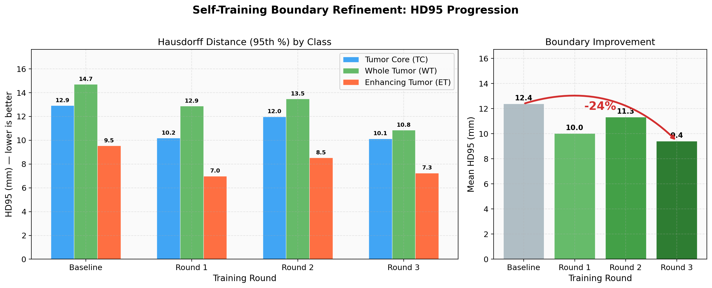
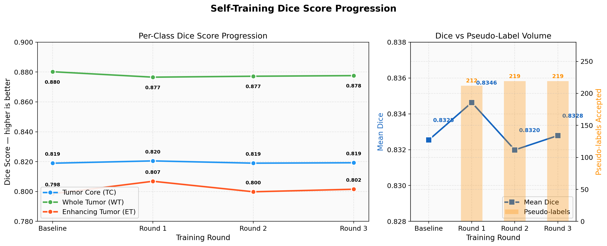
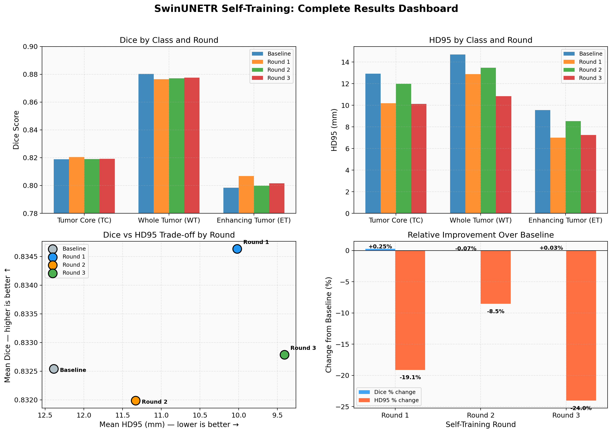

# SwinUNETR Self-Training Pipeline

**Python 3.10+** | **PyTorch 2.0+** | **MONAI 1.3+** | **License: Apache 2.0** | **Code style: ruff**

Self-training with iterative pseudo-labeling for 3D brain tumor segmentation using [SwinUNETR](https://arxiv.org/abs/2201.01266) and [MONAI](https://monai.io/). Leverages 266 unlabeled MRI volumes (~55% more data) alongside 484 labeled volumes from the [Medical Segmentation Decathlon](https://medicaldecathlon.com/) --- without any additional human annotation.

---

## Architecture

```
                     ITERATIVE SELF-TRAINING LOOP
    ================================================================

    Round r = 0, 1, 2, 3
    Curriculum threshold: 0.95 --------cosine--------> 0.75

    +------------------+         +--------------------+
    |  TEACHER MODEL   |  infer  |  266 Unlabeled     |
    | (EMA of student) |-------->|  MRI Volumes       |
    |  theta_t = alpha |         +----------+---------+
    |  * theta_t +     |                    |
    |  (1-alpha)       |              confidence
    |  * theta_s       |              filtering
    +--------+---------+                    |
             ^                              v
             |                   +--------------------+
         EMA update              | Pseudo-Labels      |
         (each step)             | (accepted only)    |
             |                   +----------+---------+
             |                              |
    +--------+---------+         +----------+---------+
    |  STUDENT MODEL   |  train  | Combined Dataset   |
    |  (gradient       |<--------|  387 labeled       |
    |   descent)       |         |  + N pseudo-labeled |
    +------------------+         +--------------------+
             |
             v
    +------------------+
    | Validate on 97   |
    | held-out labeled |-----> Per-round Dice, HD95
    +------------------+
```

## Key Results

### BrainSegFounder Baseline (Best Single-Model Result)

Replacing MONAI pretrained encoder weights with [BrainSegFounder](https://github.com/lab-smile/BrainSegFounder) --- a 3D foundation model pretrained on 41,400 UK Biobank brain MRIs --- produced the largest single improvement to date. BrainSegFounder uses the same SwinUNETR-Tiny architecture, making it a direct drop-in weight replacement.

| Metric | MONAI Baseline | BrainSegFounder | Improvement |
|--------|---------------|-----------------|-------------|
| Mean Dice | 0.8325 | **0.8453** | **+1.54%** |
| TC Dice | 0.8189 | 0.8320 | +1.60% |
| WT Dice | 0.8802 | 0.8909 | +1.21% |
| ET Dice | 0.7985 | 0.8129 | **+1.80%** |
| Mean HD95 (mm) | 12.39 | **6.48** | **-47.7%** |

**Why it works**: BrainSegFounder's two-stage self-supervised pretraining (anatomical structure learning → disease-specific attribute learning) produces encoder features specifically tuned for brain MRI analysis. This is a much stronger initialization than MONAI's general-purpose SSL, particularly for the small, irregular enhancing tumor (ET) class where learned features matter most.

**Training details**: SwinUNETR-Tiny (feature_size=48), 128³ roi_size, AdamW (lr=1e-4), warmup cosine schedule (50 epoch warmup), DiceCE loss, AMP, batch_size=1, early stopped at epoch 264 (best at epoch 214). ~15 hours on RTX 5070 Ti 16GB. See [docs/results.md](docs/results.md) for the full validation trajectory and detailed analysis.

### Self-Training Results

Self-training achieved **marginal Dice improvement but 24% sharper boundaries** (HD95), with the hardest class (Enhancing Tumor) benefiting most. These results use the MONAI baseline at 96³ roi_size (required for dual teacher-student models on 16GB VRAM).

| Metric | Baseline (96³) | Best Self-Trained | Improvement |
|--------|----------|-------------------|-------------|
| Mean Dice | 0.8325 | 0.8346 (Round 1) | +0.25% |
| TC Dice | 0.8189 | 0.8205 (Round 1) | +0.19% |
| WT Dice | 0.8802 | 0.8776 (Round 3) | -0.30% |
| ET Dice | 0.7985 | 0.8069 (Round 1) | **+1.05%** |
| Mean HD95 (mm) | 12.39 | 9.41 (Round 3) | **-24.0%** |

Per-class boundary improvement (HD95 reduction from baseline):

```
TC:  12.9 → 10.1 mm  (-21.6%)    ██████████████████░░░░░░  Round 3
WT:  14.7 → 10.8 mm  (-26.2%)    ██████████████████████░░  Round 3
ET:   9.5 →  7.0 mm  (-26.7%)    ██████████████████████░░  Round 1
```

### Key Findings

- **Domain-specific pretraining > semi-supervised learning** at this dataset scale (484 labeled volumes). BrainSegFounder achieved 6x more Dice improvement (+1.54% vs +0.25%) and 2x better HD95 improvement (-47.7% vs -24.0%) than self-training, with zero additional data engineering.
- **ET class consistently benefits most** from both approaches (+1.80% from BrainSegFounder, +1.05% from self-training). Methods that improve feature quality disproportionately help the hardest class.
- **Boundary refinement is self-training's primary value.** Dice barely moved, but HD95 improved dramatically — clinically meaningful for radiotherapy planning.
- **80-82% of unlabeled volumes accepted** as pseudo-labels. The remaining 18% were correctly identified as too ambiguous.
- **Next step**: Self-training from the BrainSegFounder baseline to combine both approaches.





See [docs/results.md](docs/results.md) for complete analysis and [docs/research-pathway.md](docs/research-pathway.md) for the improvement roadmap.

## Method Overview

Brain tumor segmentation in MRI is a critical clinical task, but expert annotation is expensive: a neuroradiologist needs 30-60 minutes per 3D volume. The MSD BraTS dataset contains 484 labeled training volumes and 266 unlabeled test volumes. Standard training ignores the unlabeled data entirely.

This project implements an **EMA teacher-student self-training framework** that progressively incorporates the unlabeled volumes through iterative pseudo-labeling. A teacher model --- maintained as an exponential moving average of the student's parameters --- generates segmentation predictions on unlabeled volumes. These predictions are filtered by per-class confidence thresholds, and only high-confidence pseudo-labels are retained for training.

The training objective combines three loss components: a standard DiceCE loss on labeled data, a DiceCE loss on pseudo-labeled data (masked by confidence), and an MSE consistency loss encouraging agreement between student and teacher predictions. The pseudo-label and consistency terms ramp up linearly over the first 20 epochs of each round to prevent early instability.

**Curriculum thresholding** is the key mechanism for managing pseudo-label quality. Confidence thresholds follow a cosine schedule from 0.95 to 0.75 across four rounds, with per-class offsets that are stricter for the hardest class (Enhancing Tumor, +0.05) and more permissive for the easiest (Whole Tumor, -0.05). This means the pipeline starts conservatively --- accepting only the most confident predictions --- and gradually incorporates harder cases as the model improves.

The pipeline runs four rounds of: pseudo-label generation, confidence filtering, combined training (100 epochs/round), and EMA teacher updates. Each round benefits from an improved teacher, creating a virtuous cycle of better pseudo-labels leading to better models.

## Quick Start

### Install

```bash
git clone https://github.com/rgbussell/swinunetr_self_training.git
cd swinunetr_self_training
pip install -e ".[dev]"
```

**Prerequisite:** The base segmentation package must be installed first:
```bash
git clone https://github.com/rgbussell/vit_swinunetr_segmentation.git
cd vit_swinunetr_segmentation
pip install -e .
```

### Data Setup

Download the MSD Task01 Brain Tumour dataset and pretrained weights using the base package scripts:
```bash
cd /path/to/vit_swinunetr_segmentation
python scripts/download_data.py --output-dir data

# Option A: MONAI pretrained weights (general-purpose SSL)
python scripts/download_weights.py --output-dir pretrained

# Option B: BrainSegFounder weights (brain-specific SSL, recommended)
python scripts/download_brainsegfounder.py --output-dir pretrained/brainsegfounder
```

### Run Self-Training

```bash
# Full pipeline: 4 rounds of pseudo-labeling + retraining
st-train --config configs/self_training_config.yaml

# Generate pseudo-labels only (from a specific checkpoint)
st-pseudo-label --config configs/self_training_config.yaml \
    --checkpoint checkpoints/round0_best.pt --round 1

# Compare baseline vs self-training results
st-compare --baseline-results results/baseline_metrics.csv \
    --self-training-results results/round3_metrics.csv
```

### Run Tests

```bash
pytest tests/ -v
```

## Project Structure

```
swinunetr_self_training/
├── configs/
│   └── self_training_config.yaml    # All hyperparameters (model, training, thresholds, paths)
├── src/swinunetr_st/
│   ├── data/
│   │   ├── unlabeled_dataset.py     # Load 266 unlabeled MRI volumes from imagesTs/
│   │   ├── pseudo_label_dataset.py  # Combined labeled + pseudo-labeled CacheDataset
│   │   └── strong_transforms.py     # FixMatch-style strong augmentations
│   ├── models/
│   │   ├── ema_teacher.py           # EMA teacher wrapper with warmup and serialization
│   │   └── losses.py               # Three-component self-training loss
│   ├── training/
│   │   ├── self_trainer.py          # Main iterative training orchestration
│   │   ├── pseudo_labeler.py        # Confidence-filtered pseudo-label generation
│   │   └── curriculum.py            # Threshold scheduling (linear/cosine/step)
│   ├── analysis/
│   │   ├── comparison.py            # Baseline vs self-training statistical comparison
│   │   └── convergence.py           # Per-round convergence analysis and visualization
│   ├── utils/
│   │   └── config.py               # YAML config loading, validation, merging
│   └── cli.py                      # Entry points: st-train, st-pseudo-label, st-compare
├── scripts/
│   ├── run_self_training.py         # Script-based training launcher
│   ├── generate_pseudo_labels.py    # Standalone pseudo-label generation
│   └── evaluate_improvement.py      # Evaluation comparison script
├── notebooks/
│   ├── 01_baseline_analysis.ipynb       # Data exploration and baseline evaluation
│   ├── 02_self_training_walkthrough.ipynb  # Step-by-step self-training demonstration
│   ├── 03_results_comparison.ipynb      # Statistical comparison and visualization
│   └── 04_educational_guide.ipynb       # Semi-supervised learning tutorial
├── docs/
│   ├── method.md                    # Full methodology (arxiv-style writeup)
│   ├── results.md                   # Complete results and analysis
│   ├── research-pathway.md          # Improvement roadmap (11 strategies, 4 tiers)
│   ├── training-notes.md            # Known issues, bug fixes, hardware notes
│   └── newsletter/
│       └── newsletter_draft.md      # Professional newsletter draft
├── figures/                         # Publication-quality visualizations
│   ├── hd95_boundary_improvement.png
│   ├── dice_progression.png
│   ├── results_dashboard.png
│   └── boundary_focus.png
├── tests/                           # Unit and integration tests
├── .github/
│   └── workflows/ci.yml            # CI pipeline
├── pyproject.toml                   # Package configuration
├── .pre-commit-config.yaml          # Pre-commit hooks (ruff, detect-secrets)
└── README.md                        # This file
```

## Configuration

All hyperparameters are centralized in `configs/self_training_config.yaml`:

```yaml
self_training:
  num_rounds: 4              # Iterative refinement rounds
  epochs_per_round: 100      # Training epochs per round
  ema_decay: 0.999           # Teacher EMA decay rate
  initial_threshold: 0.95    # Starting confidence threshold
  final_threshold: 0.75      # Ending confidence threshold
  threshold_schedule: cosine # Schedule type: linear, cosine, step
  per_class_offsets:         # Per-class threshold adjustments
    TC: 0.0                  #   Tumor Core: baseline
    WT: -0.05                #   Whole Tumor: accept more easily
    ET: 0.05                 #   Enhancing Tumor: stricter filtering
  supervised_weight: 1.0     # Supervised loss weight
  pseudo_label_weight: 0.5   # Pseudo-label loss weight
  consistency_weight: 0.1    # Consistency loss weight
  ramp_up_epochs: 20         # Linear ramp-up for pseudo/consistency losses

training:
  lr: 5.0e-5                 # Lower LR for fine-tuning
  weight_decay: 1.0e-5
  batch_size: 1
  amp: true                  # Mixed precision training
```

See [docs/method.md](docs/method.md) for detailed explanation of each parameter.

## Per-Round Self-Training Results

| Round | Threshold Range | Accepted | Mean Dice | HD95 (mm) | Early Stop |
|-------|----------------|----------|-----------|-----------|------------|
| MONAI Baseline (96³) | N/A | N/A | 0.8325 | 12.39 | Epoch 119/300 |
| Round 1 | 0.95→0.91 / 0.90→0.86 / 1.00→0.96 | 212/266 (80%) | **0.8346** | 10.02 | Epoch 39/100 |
| Round 2 | 0.91→0.82 / 0.86→0.77 / 0.96→0.87 | 219/266 (82%) | 0.8320 | 11.33 | Epoch 44/100 |
| Round 3 | 0.82→0.75 / 0.77→0.70 / 0.87→0.80 | 219/266 (82%) | 0.8328 | **9.41** | Epoch 79/100 |
| **BSF Baseline (128³)** | **N/A** | **N/A** | **0.8453** | **6.48** | **Epoch 214/300** |

## Documentation

| Document | Description |
|----------|-------------|
| [Methodology](docs/method.md) | Full arxiv-style writeup of the self-training approach |
| [Results & Analysis](docs/results.md) | Complete results with per-class analysis and cost-benefit |
| [Research Pathway](docs/research-pathway.md) | Prioritized roadmap for further improvement (11 strategies, 4 tiers) |
| [Newsletter](docs/newsletter/newsletter_draft.md) | Accessible overview for ML practitioners |
| [Training Notes](docs/training-notes.md) | Known issues, bug fixes, hardware notes |
| [Baseline Analysis](notebooks/01_baseline_analysis.ipynb) | Data exploration and baseline metrics |
| [Self-Training Walkthrough](notebooks/02_self_training_walkthrough.ipynb) | Interactive demonstration |
| [Results Comparison](notebooks/03_results_comparison.ipynb) | Statistical analysis notebook |
| [Educational Guide](notebooks/04_educational_guide.ipynb) | Semi-supervised learning tutorial |

## Citation

If you use this code or find it useful, please cite:

```bibtex
@article{hatamizadeh2022swinunetr,
  title={Swin UNETR: Swin Transformers for Semantic Segmentation of
         Brain Tumors in MRI Images},
  author={Hatamizadeh, Ali and Nath, Vishwesh and Tang, Yucheng and
          Yang, Dong and Roth, Holger R and Xu, Daguang},
  journal={International MICCAI Brainlesion Workshop},
  pages={272--284},
  year={2022},
  publisher={Springer}
}

@article{simpson2019msd,
  title={A large annotated medical image dataset for the development
         and evaluation of segmentation algorithms},
  author={Simpson, Amber L and Antonelli, Michela and Bakas, Spyridon
          and others},
  journal={arXiv preprint arXiv:1902.09063},
  year={2019}
}

@article{tarvainen2017mean,
  title={Mean teachers are better role models: Weight-averaged consistency
         targets improve semi-supervised learning results},
  author={Tarvainen, Antti and Valpola, Harri},
  journal={Advances in Neural Information Processing Systems},
  year={2017}
}

@article{sohn2020fixmatch,
  title={FixMatch: Simplifying Semi-Supervised Learning with Consistency
         and Confidence},
  author={Sohn, Kihyuk and Berthelot, David and Carlini, Nicholas and
          others},
  journal={Advances in Neural Information Processing Systems},
  year={2020}
}

@article{ren2024brainsegfounder,
  title={BrainSegFounder: Towards 3D Foundation Models for Neuroimage
         Segmentation},
  author={Ren, Jingyi and others},
  journal={Medical Image Analysis},
  year={2024},
  note={arXiv:2406.10395}
}
```

## Acknowledgments

- [MONAI](https://monai.io/) --- Medical Open Network for Artificial Intelligence framework
- [Medical Segmentation Decathlon](https://medicaldecathlon.com/) --- Brain Tumour dataset
- [NVIDIA Research](https://github.com/Project-MONAI/research-contributions/tree/main/SwinUNETR) --- SwinUNETR reference implementation and pretrained weights
- [BrainSegFounder](https://github.com/lab-smile/BrainSegFounder) --- 3D foundation model for brain MRI segmentation (Ren et al., 2024)
- [vit_swinunetr_segmentation](https://github.com/rgbussell/vit_swinunetr_segmentation) --- Base segmentation package this project extends

## License

[Apache 2.0](LICENSE)
